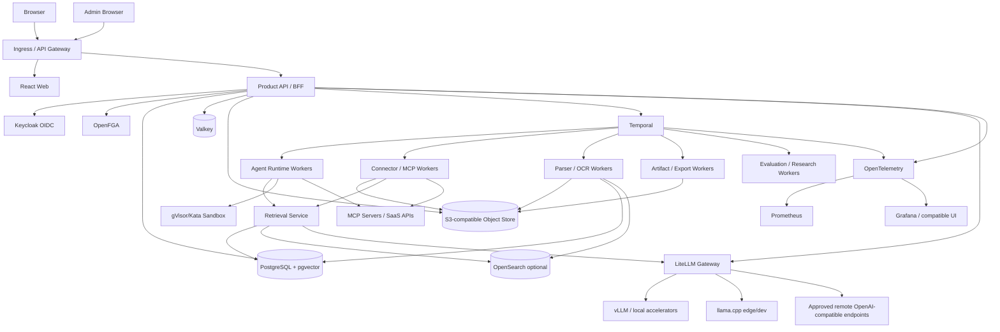

# Fully open-source reference architecture

> **Historical design proposal — 2026-08-22.** These requirements describe
> a possible North-equivalent rebuild, not an accepted Borealis roadmap or its
> implemented architecture. See the [archive overview](README.md),
> [current Borealis docs](../../README.md), and
> [completed implementation plans](../../plans/README.md).

**Status:** independent design proposal, not a claim about Cohere's private implementation<br>
**Target:** feature-complete North-equivalent with clean-room code and swappable components

## 1. Architecture principles

1. **Modular monolith first, service boundaries explicit.** Keep product logic cohesive until scaling/isolation demands separation.
2. **PostgreSQL is the source of truth.** Caches, indexes, and projections are rebuildable.
3. **Durable workflows for long work.** Chat background tasks, sync, parsing, evaluations, research, exports, and automations share a durable execution substrate.
4. **Authorization before retrieval and action.** Tenant/resource/source/tool policy is enforced server-side at every boundary.
5. **OpenAI-compatible model gateway, capability-aware profiles.** No product code assumes one model/provider.
6. **Source and artifact versioning.** Citations and runs resolve immutable inputs/outputs.
7. **Egress is explicit.** Local, remote, and effectful capabilities are separately classified and visible.
8. **Content-minimized operations.** Audit/telemetry/support evidence excludes private content by default.
9. **No copyleft surprise.** Maintain an automated license/SBOM policy and consciously isolate or replace reciprocal components where distribution requirements matter.
10. **Independent UX.** Reproduce workflows and accessibility, not Cohere branding/trade dress.

## 2. Logical topology



## 3. Recommended component map

Licenses below refer to the named upstream project at the cited repository; dependencies, plugins, container bases, and models require separate verification.

| Capability | Recommended OSS | License signal | Alternatives / notes |
|---|---|---|---|
| Web app | React, TypeScript, Vite, TanStack Query/Router | permissive ecosystems | Next.js is viable; avoid proprietary cloud coupling. |
| Rich document editor | ProseMirror | MIT.[104] | Lexical (MIT); build project-owned extensions. |
| Tables | TanStack Table/Virtual + project data grid | MIT core | AG Grid Community is MIT; avoid enterprise-only features. |
| Charts | Apache ECharts | Apache-2.0.[103] | Vega/Vega-Lite (BSD); matplotlib for static export. |
| API/BFF | Fastify + TypeScript | MIT | FastAPI is excellent for Python-heavy teams. Existing repo already uses Fastify. |
| Durable workflows | Temporal Server + SDKs | MIT.[93] | PostgreSQL-backed custom engine only for much smaller scope; avoid in-memory queues for HITL. |
| Primary DB/vector | PostgreSQL + pgvector | PostgreSQL license.[95] | Qdrant (Apache-2.0) if vector scale/operations require separation. |
| Search | OpenSearch | Apache-2.0.[94] | Start with Postgres full-text + pgvector; add OpenSearch for scale/multilingual faceting. |
| Cache/coordination | Valkey | BSD-3-Clause.[96] | Keep durable state out of cache. |
| Object store | SeaweedFS S3 gateway | Apache-2.0.[101] | Cloud S3 is acceptable; current MinIO licensing is not part of the permissive/open baseline and requires separate commercial/legal review.[114] |
| Identity | Keycloak | Apache-2.0.[92] | Dex for broker-only needs; Authentik uses a different license model. |
| Fine-grained auth | OpenFGA | Apache-2.0.[91] | OPA for attribute/policy evaluation; Casbin for smaller deployments. |
| Secrets/KMS | OpenBao | MPL-2.0.[100] | Cloud KMS/secret managers; SOPS for GitOps secrets, not runtime delegation alone. |
| Model gateway | LiteLLM | MIT license file.[107] | Project-owned thin gateway if minimizing dependency/feature breadth. |
| GPU inference | vLLM | Apache-2.0.[97] | SGLang, TGI; verify versions and model licenses. |
| CPU/edge inference | llama.cpp | MIT.[98] | Ollama adds packaging convenience; inspect distribution/license details. |
| Parsing | Docling | MIT.[99] | Apache Tika, Tesseract, LibreOffice headless; validate every parser dependency. |
| Sandbox isolation | gVisor | Apache-2.0.[102] | Kata Containers/Firecracker for stronger VM boundary; Kubernetes Jobs alone are insufficient. |
| Eventing | NATS JetStream | Apache-2.0.[108] | Temporal handles workflow tasks; NATS for transient domain events/fan-out. |
| Telemetry | OpenTelemetry Collector | Apache-2.0.[105] | Prometheus (Apache-2.0), Grafana is AGPL-3.0.[106] |
| Packaging | OCI images, Helm, cosign, Syft/Grype | mostly Apache-2.0 | Harbor registry, ORAS bundles, CycloneDX/SPDX. |

## 4. Service decomposition

### 4.1 Phase-one deployables

Use four deployables initially:

1. **web** — user/admin React application.
2. **api** — authz, organizations, agents, chats, files/libraries, workflow definitions, admin, API contract.
3. **workers** — Temporal activities grouped by queue: agent, connector, parse, artifact, evaluation/research.
4. **model-gateway** — LiteLLM; local vLLM/llama.cpp backends.

Shared infrastructure: PostgreSQL/pgvector, Valkey, object storage, Temporal, Keycloak, OpenFGA, OTel/Prometheus. Add OpenSearch only when measured retrieval/index scale requires it.

### 4.2 Split triggers

Split a module when at least one is true:

- materially different security boundary (sandbox, connector credentials);
- independent GPU/runtime dependency;
- independent scaling/SLO;
- failure isolation need;
- separate data lifecycle or compliance domain;
- deployment/update cadence that cannot safely remain shared.

Likely later services: retrieval/indexing, connector gateway, artifact renderer, notification service, sandbox controller, model gateway, admin/control plane.

## 5. Storage architecture

### 5.1 PostgreSQL schemas

```text
identity       organizations, users, groups, service principals
policy         roles, grants, approval policies, decision evidence
agents         definitions, versions, eval definitions/runs
chat           conversations, messages, background tasks, citations
knowledge      files, versions, segments, sources, connections, libraries
workflows      definitions, versions, schedules, runs, node attempts, review tasks
artifacts      artifacts, versions, exports, shares
operations     notifications, audit events, outbox, usage records
```

Use organization ID on every tenant record, composite tenant-aware foreign keys where practical, and RLS as defense in depth. Application authorization remains mandatory.

### 5.2 Indexes

**MVP:** PostgreSQL full-text/trigram + pgvector HNSW/IVFFlat; table partitioning by organization/time as needed.

**Scale profile:** OpenSearch for lexical/multilingual filtering and vector candidates; retain canonical segment/version/ACL metadata in PostgreSQL. Index entries include organization, source version, segment locator, authorization projection revision, language/modality, and content hash.

### 5.3 Objects

Buckets/prefixes:

```text
quarantine/       untrusted uploads
source-original/  immutable source versions
source-derived/   parse/OCR/table/chunk artifacts
artifact/         document/table/report versions
exports/          generated PDF/DOCX/HTML/CSV
sandbox/          expiring session/generated files
backup/           encrypted backups/snapshots
```

Object keys are opaque IDs, never user filenames. Metadata/authorization lives in PostgreSQL; signed URLs are short-lived and scope-bound.

## 6. Agent runtime

```text
AgentTurn workflow
1. snapshot conversation + agent version + policy
2. resolve model, source, capability, and tool bindings
3. retrieve authorized context
4. call model through gateway
5. validate tool calls / structured output
6. request approval for effectful action or execute read-only tool
7. append typed stream events
8. repeat within round/time/token budgets
9. persist final message, citations, usage, safe execution trace
10. finalize or hand off as background task
```

### 6.1 Tool-loop controls

- max model/tool rounds;
- total context/output/token/wall-clock budgets;
- per-tool timeout and response-size limit;
- schema validation and effect classification;
- idempotency for writes;
- prompt-injection-aware source/tool result labeling;
- cancellation propagation;
- deterministic event IDs and exactly-once finalization.

### 6.2 Stream protocol

Use SSE with typed events compatible with the documented North/Open Responses surface where required:[58][59]

```text
response.created
message.started
delta.text
citation.added
plan.summary
tool.call.created
tool.call.arguments
tool.call.waiting_approval
tool.call.completed
artifact.created
usage.updated
response.completed
response.failed
```

Never stream raw hidden chain-of-thought. Stream safe plan/execution summaries.

## 7. Retrieval/RAG pipeline

### 7.1 Parse

- Docling/Tika/LibreOffice/Tesseract workers;
- preserve pages, headings, tables, sheets, cells, images, language, and source coordinates;
- deterministic parser version + config hash;
- quarantine failures and partial parse status.

### 7.2 Chunk

Use structure-aware segmentation with bounded token/character size and overlap only where necessary. Tables retain row/column coordinates; images retain page/region/caption. Do not claim this matches Compass.

### 7.3 Embed/retrieve/rerank

- pluggable embedding and reranking profiles;
- lexical + dense + sparse semantic candidates;
- ACL/source/library filters before content return;
- rerank top candidates;
- dedupe/diversity/freshness;
- citation spans from immutable segments.

Model choices are deployment configuration. Each model profile must record license, revision/digest, dimensions/context, languages/modalities, hardware, benchmark results, and commercial-use policy.

## 8. Workflow engine

Temporal maps naturally to durable North-like semantics:

- workflow definition/version stored by product API;
- a generic interpreter workflow executes graph snapshots;
- child workflows for loops/parallel branches/research;
- activities for LLM, tool, retrieval, export, notifications;
- signals/updates for human review and cancellation;
- timers for timeouts/schedules;
- deterministic workflow code; versioning for engine upgrades;
- PostgreSQL stores product/run projections, while Temporal is runtime history.

Do not put prompts/secrets in Temporal search attributes. Encrypt payloads with a custom codec when content enters workflow history; store large content in object storage and pass opaque refs.

## 9. Identity/policy implementation

- Keycloak handles OIDC/SAML federation, PKCE, sessions, service clients.
- OpenFGA handles organization/resource relationships.
- Product DB stores roles, grants, policy metadata, and decision evidence.
- OPA or a project policy evaluator handles attributes: egress class, data classification, action effects, retention, maturity, model/tool restrictions.

Authorization check order:

```text
tenant → feature → global permission → relation → source ACL → model/tool policy → approval → lifecycle
```

## 10. Sandbox architecture

A sandbox controller creates one short-lived gVisor/Kata pod/microVM per conversation/workflow session:

- read-only object-FUSE or staged input directory;
- writable quota-limited output directory;
- no service account token;
- non-root/read-only root/capability drop/seccomp;
- deny-all egress with optional proxy-mediated domain allowlist;
- fixed runtime images for Data Interpreter;
- optional controlled package cache for Code Sandbox;
- heartbeat, timeout, kill, output scan, and object upload.

The LLM never gets Kubernetes credentials. It talks to a narrow sandbox RPC service.

## 11. Connector/MCP gateway

- outbound egress proxy;
- encrypted credential broker;
- MCP transports and first-party adapter SDK;
- manifest discovery/hash/drift approval;
- server/tool/member policy from OpenFGA/OPA;
- rate limits, timeouts, response limits, circuit breakers;
- input/output schema validation;
- action approvals and idempotency;
- result/citation normalization.

MCP Apps render in a separate sandboxed origin with CSP, no arbitrary parent DOM access, and an explicit JSON bridge.

## 12. Artifact rendering

- ProseMirror JSON as canonical document structure;
- versioned operations/diffs and Yjs only if live multi-user editing is later required;
- WeasyPrint/Chromium or equivalent deterministic PDF pipeline;
- python-docx/LibreOffice for DOCX as needed;
- ECharts spec for interactive HTML and a static renderer for PDF;
- export workers with no uncontrolled network;
- artifact/source/run metadata and hashes embedded where format allows.

## 13. Deployment profiles

### Developer

Docker Compose: one API, worker, PostgreSQL/pgvector, Valkey, Temporal, Keycloak/OpenFGA, local object storage, llama.cpp or remote approved endpoint. No Kubernetes requirement.

### Appliance/single organization

Kubernetes/k3s: HA optional, local model gateway, SeaweedFS/S3, PostgreSQL operator, backups to external encrypted storage, sealed egress option.

### Enterprise production

Kubernetes 1.30+, managed/external PostgreSQL/object storage/OpenSearch where appropriate, multiple worker/model pools, Keycloak federation, OpenFGA HA, Temporal HA, KMS, ingress/admin segmentation, private registry/mirror, full observability and DR.

## 14. License exclusions and cautions

A “source available” repository is not automatically acceptable for a fully open-source baseline. In particular:

- Current MinIO licensing requires separate review and is not used as the baseline object store here.[114]
- n8n's Sustainable Use License restricts use and is not an OSI-style open-source choice for the workflow core.[115]
- Elastic's distribution/licensing differs from a straightforward permissive baseline; this architecture selects Apache-2.0 OpenSearch instead.[94][116]
- Grafana is AGPL-3.0: valid open source, but intentionally outside the permissive-first core unless its obligations are accepted.[106]
- Model weights, datasets, fonts, icons, and frontend extensions have licenses separate from the surrounding code.

## 15. License and supply-chain gate

For every dependency/model/container:

- exact version/digest and source URL;
- SPDX license and obligations;
- source-offer/notices requirements;
- commercial-use/model acceptable-use restrictions;
- transitive dependencies and generated assets;
- SBOM and vulnerabilities;
- signature/provenance;
- approval status per distribution profile.

`Open source` applies to code licenses, not automatically to model weights, datasets, fonts, icons, or SaaS APIs. Do not ship a model until its exact revision's license and redistribution terms are reviewed.

## 16. Recommended build order

1. Identity/organization/authz/audit foundation.
2. Files → parse/index → retrieval → citations.
3. Chat streaming + agent versions + tool loop.
4. Libraries and connector/MCP gateway.
5. Durable background tasks/notifications.
6. Documents/artifacts/exports.
7. Workflow engine + runs + HITL.
8. Agent evaluations and deep research.
9. Tables and Code Sandbox.
10. Enterprise scale/HA/air-gap/marketplace breadth.

## Sources

[58] https://private.docs.cohere.com/reference/open-responses-compatibility
[59] https://private.docs.cohere.com/reference/chat-stream
[91] https://github.com/openfga/openfga/blob/main/LICENSE
[92] https://github.com/keycloak/keycloak/blob/main/LICENSE.txt
[93] https://github.com/temporalio/temporal/blob/main/LICENSE
[94] https://github.com/opensearch-project/OpenSearch/blob/main/LICENSE.txt
[95] https://github.com/pgvector/pgvector/blob/master/LICENSE
[96] https://github.com/valkey-io/valkey/blob/unstable/COPYING
[97] https://github.com/vllm-project/vllm/blob/main/LICENSE
[98] https://github.com/ggml-org/llama.cpp/blob/master/LICENSE
[99] https://github.com/docling-project/docling/blob/main/LICENSE
[100] https://github.com/openbao/openbao/blob/main/LICENSE
[101] https://github.com/seaweedfs/seaweedfs/blob/master/LICENSE
[102] https://github.com/google/gvisor/blob/master/LICENSE
[103] https://github.com/apache/echarts/blob/master/LICENSE
[104] https://github.com/ProseMirror/prosemirror-view/blob/master/LICENSE
[105] https://github.com/open-telemetry/opentelemetry-collector/blob/main/LICENSE
[106] https://github.com/grafana/grafana/blob/main/LICENSE
[107] https://github.com/BerriAI/litellm/blob/main/LICENSE
[108] https://github.com/nats-io/nats-server/blob/main/LICENSE
[114] https://docs.min.io/license
[115] https://docs.n8n.io/privacy-and-security/sustainable-use-license
[116] https://www.elastic.co/pricing/faq/licensing
