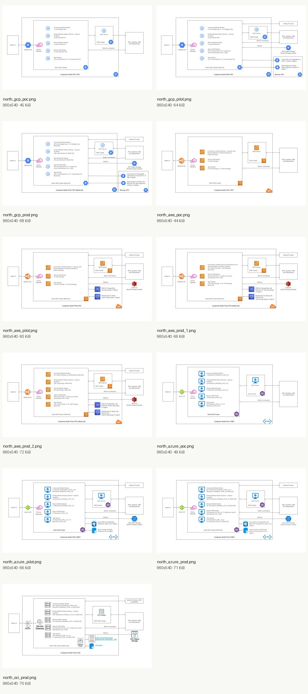

# Cohere North public reference architecture diagrams

> **Historical evidence — 2026-08-22 capture.** This catalog documents the
> archived North research, not current Borealis UI, deployment, or API behavior.
> See the [archive overview](../README.md) and
> [current Borealis documentation](../../../README.md).

These 11 diagrams were downloaded from Cohere's public deployment documentation on 2026-08-22. They cover proof-of-concept, pilot, and production reference profiles across GCP, AWS, Azure, and OCI.[51]

## Inventory

| Cloud | Profile | File |
|---|---|---|
| GCP | Proof of concept | [north_gcp_poc.png](north_gcp_poc.png) |
| GCP | Pilot | [north_gcp_pilot.png](north_gcp_pilot.png) |
| GCP | Production | [north_gcp_prod.png](north_gcp_prod.png) |
| AWS | Proof of concept | [north_aws_poc.png](north_aws_poc.png) |
| AWS | Pilot | [north_aws_pilot.png](north_aws_pilot.png) |
| AWS | Production option 1 | [north_aws_prod_1.png](north_aws_prod_1.png) |
| AWS | Production option 2 | [north_aws_prod_2.png](north_aws_prod_2.png) |
| Azure | Proof of concept | [north_azure_poc.png](north_azure_poc.png) |
| Azure | Pilot | [north_azure_pilot.png](north_azure_pilot.png) |
| Azure | Production | [north_azure_prod.png](north_azure_prod.png) |
| OCI | Production | [north_oci_prod.png](north_oci_prod.png) |

All files decode as 960×540 PNG images and were visually verified. Machine-readable provenance, original direct image URLs, byte sizes, dimensions, and SHA-256 hashes are in [`sources.json`](sources.json).

## Common topology visible in the diagrams

The diagrams consistently show a customer-controlled private network, a Kubernetes cluster, ingress/gateway, separate model/embedding/rerank/search worker pools, an MCP cluster or service, identity-provider connectivity, business APIs/systems/data repositories, and storage/database/search dependencies. Pilot and production profiles externalize and/or replicate data services and scale node pools; production diagrams add multi-zone or multi-node capacity. These statements describe the public diagrams, not undisclosed implementation internals.[51]

## Clean-room and copyright note

Cohere and its licensors retain rights in the diagrams. Keep them as attributed research evidence; do not ship them as project artwork. The reimplementation should use independently drawn diagrams and independently designed deployment templates. Copy behavior and interoperability requirements only where documented, not proprietary visual styling or private implementation assumptions.

## Sources

[51] https://private.docs.cohere.com/docs/architecture-diagrams
