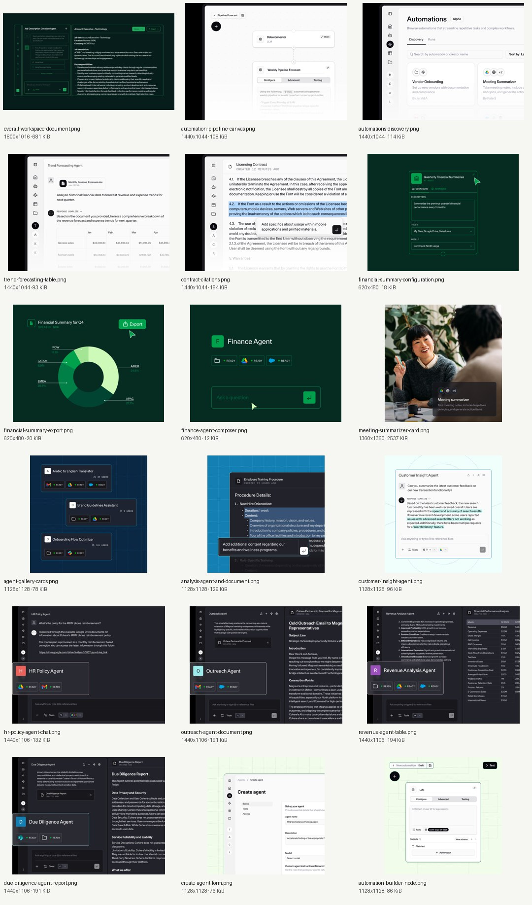

# Cohere North UI screenshot research

> **Historical evidence — 2026-08-22 capture.** This catalog documents the
> archived North research, not current Borealis UI, deployment, or API behavior.
> See the [archive overview](../README.md) and
> [current Borealis documentation](../../../README.md).

This folder contains a compact, verified subset of public Cohere North product images collected for **comparative technical research and clean-room reimplementation planning**. The images are not implementation assets and must not be copied into the rebuilt product.

The curated set covers the primary chat/document workspace, automation canvas and discovery, agent chat, citations, tables, generated documents, report/export surfaces, the agent gallery, agent creation, and an automation-builder node. The original images were embedded on Cohere's North, Workplace Productivity, and Agent Studio pages.[5][6][62]

## Catalog

| File | Surface | Source page |
|---|---|---|
| [overall-workspace-document.png](overall-workspace-document.png) | Dark primary workspace with agent chat, composer, navigation, and generated document | [North](https://cohere.com/north) |
| [automation-pipeline-canvas.png](automation-pipeline-canvas.png) | Connected automation graph with node inspector tabs | [North](https://cohere.com/north) |
| [automations-discovery.png](automations-discovery.png) | Automations discovery gallery and tabs | [North](https://cohere.com/north) |
| [trend-forecasting-table.png](trend-forecasting-table.png) | Agent answer with inline structured table | [North](https://cohere.com/north) |
| [contract-citations.png](contract-citations.png) | Document Q&A with highlighted citation evidence | [North](https://cohere.com/north) |
| [financial-summary-configuration.png](financial-summary-configuration.png) | Tool/agent configuration form | [North](https://cohere.com/north) |
| [financial-summary-export.png](financial-summary-export.png) | Generated chart with export action | [North](https://cohere.com/north) |
| [finance-agent-composer.png](finance-agent-composer.png) | Agent card/composer with connected-source badges | [North](https://cohere.com/north) |
| [meeting-summarizer-card.png](meeting-summarizer-card.png) | Workplace agent card | [Workplace Productivity](https://cohere.com/north/workplace-productivity) |
| [agent-gallery-cards.png](agent-gallery-cards.png) | Reusable agent gallery cards | [Workplace Productivity](https://cohere.com/north/workplace-productivity) |
| [analysis-agent-and-document.png](analysis-agent-and-document.png) | Agent layered over a generated document | [Workplace Productivity](https://cohere.com/north/workplace-productivity) |
| [customer-insight-agent.png](customer-insight-agent.png) | Light-theme agent response surface | [Workplace Productivity](https://cohere.com/north/workplace-productivity) |
| [hr-policy-agent-chat.png](hr-policy-agent-chat.png) | Dark-theme agent chat | [Agent Studio](https://cohere.com/north/agent-studio) |
| [outreach-agent-document.png](outreach-agent-document.png) | Agent chat beside generated outreach document | [Agent Studio](https://cohere.com/north/agent-studio) |
| [revenue-agent-table.png](revenue-agent-table.png) | Agent chat beside a financial table | [Agent Studio](https://cohere.com/north/agent-studio) |
| [due-diligence-agent-report.png](due-diligence-agent-report.png) | Agent chat beside a generated report | [Agent Studio](https://cohere.com/north/agent-studio) |
| [create-agent-form.png](create-agent-form.png) | Agent creation: Basics, Tools, Access | [Agent Studio](https://cohere.com/north/agent-studio) |
| [automation-builder-node.png](automation-builder-node.png) | Builder canvas with Configure/Advanced/Testing tabs | [Agent Studio](https://cohere.com/north/agent-studio) |

Machine-readable provenance, dimensions, byte sizes, and SHA-256 hashes are in [`sources.json`](sources.json).

## Verification

- All 18 source files decode as valid images.
- The generated contact sheet was visually inspected; none of the selected images is an error page, blank browser capture, or unrelated decorative image.
- Filenames describe visible surfaces rather than asserting hidden behavior.

## Copyright and clean-room use

Cohere and its licensors retain rights in these images and product designs. Keep them as internal research evidence, preserve attribution, do not present them as project-owned artwork, and do not ship them in the implementation. Rebuild workflows from documented behavior using an independently designed visual system; avoid pixel-level cloning, copied copywriting, logos, icons, illustrations, and proprietary trade dress.

## Sources

[5] https://cohere.com/north
[6] https://cohere.com/north/agent-studio
[62] https://cohere.com/north/workplace-productivity
